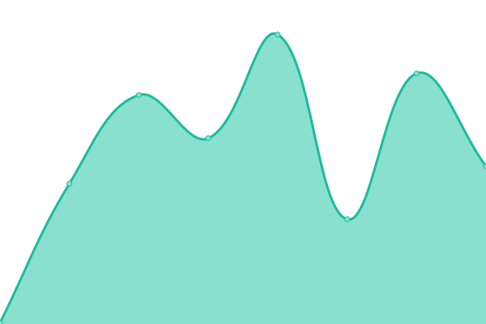
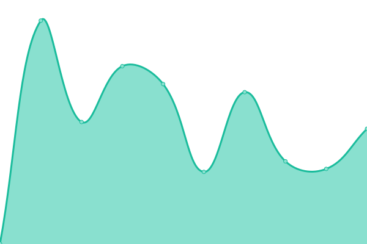

# [📈 Live Status](https://status.myapms.com): <!--live status--> **🟧 Partial outage**

This repository contains the open-source uptime monitor and status page for [Kaustubh Kulkarni](https://kaustubhk24.com), powered by [Upptime](https://github.com/upptime/upptime).

With [Upptime](https://upptime.js.org), you can get your own unlimited and free uptime monitor and status page, powered entirely by a GitHub repository. We use [Issues](https://github.com/kaustubhk24/status.myapms.com/issues) as incident reports, [Actions](https://github.com/kaustubhk24/status.myapms.com/actions) as uptime monitors, and [Pages](https://status.myapms.com) for the status page.

<!--start: status pages-->
<!-- This summary is generated by Upptime (https://github.com/upptime/upptime) -->
<!-- Do not edit this manually, your changes will be overwritten -->
<!-- prettier-ignore -->
| URL | Status | History | Response Time | Uptime |
| --- | ------ | ------- | ------------- | ------ |
|  [Developer Site](https://dev.myapms.com) | 🟥 Down | [developer-site.yml](https://github.com/kaustubhk24/status.myapms.com/commits/HEAD/history/developer-site.yml) | 

 0ms
     
 | 

<a href="https://status.myapms.com/history/developer-site">0.00%</a>
    

|  [Documentation Site](https://docs.myapms.com) | 🟩 Up | [documentation-site.yml](https://github.com/kaustubhk24/status.myapms.com/commits/HEAD/history/documentation-site.yml) | 

 123ms
     
 | 

<a href="https://status.myapms.com/history/documentation-site">100.00%</a>
    

|  [Instance 81946](https://dev81946.service-now.com/) | 🟩 Up | [instance-81946.yml](https://github.com/kaustubhk24/status.myapms.com/commits/HEAD/history/instance-81946.yml) | 

 560ms
     
 | 

<a href="https://status.myapms.com/history/instance-81946">32.61%</a>
    

<!--end: status pages-->

[**Visit our status website →**](https://status.myapms.com)

## 📄 License

- Powered by: [Upptime](https://github.com/upptime/upptime)
- Code: [MIT](./LICENSE) © [Kaustubh Kulkarni](https://kaustubhk24.com)
- Data in the `./history` directory: [Open Database License](https://opendatacommons.org/licenses/odbl/1-0/)
